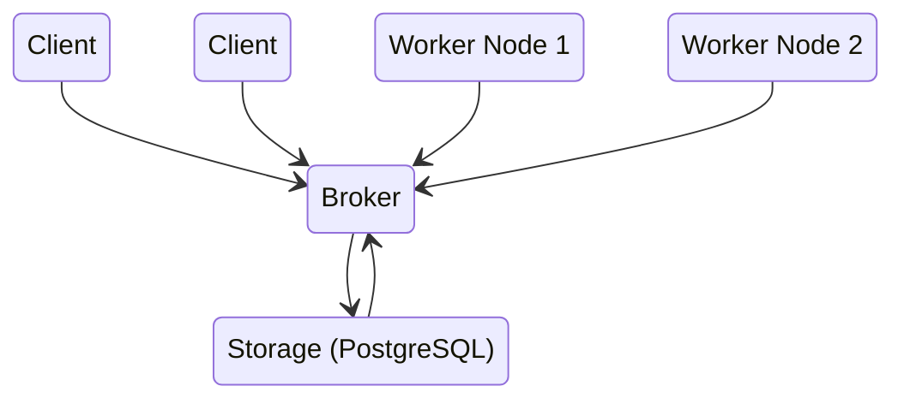

# RustQueue
### Distributed Task Queue System built in Rust

```mermaid
stateDiagram-v2
    c1: Client
    c2: Client
    b: Broker
    w1: Worker Node 1
    w2: Worker Node 2
    s: Storage (PostgreSQL)
    
    c1 --> b
    c2 --> b
    w1 --> b
    w2 --> b
    s --> b
    b --> s
```